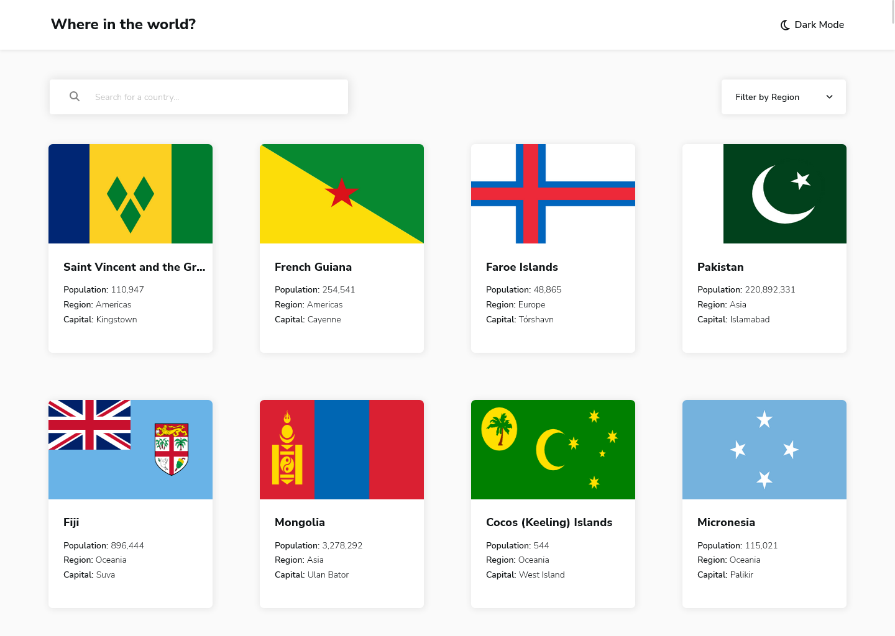
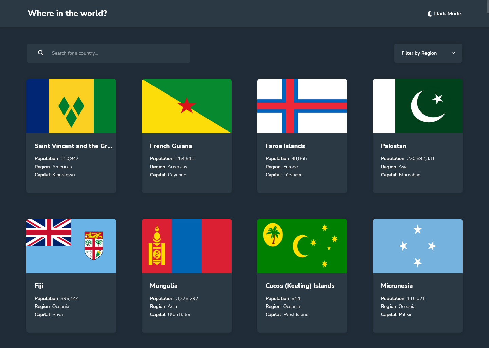
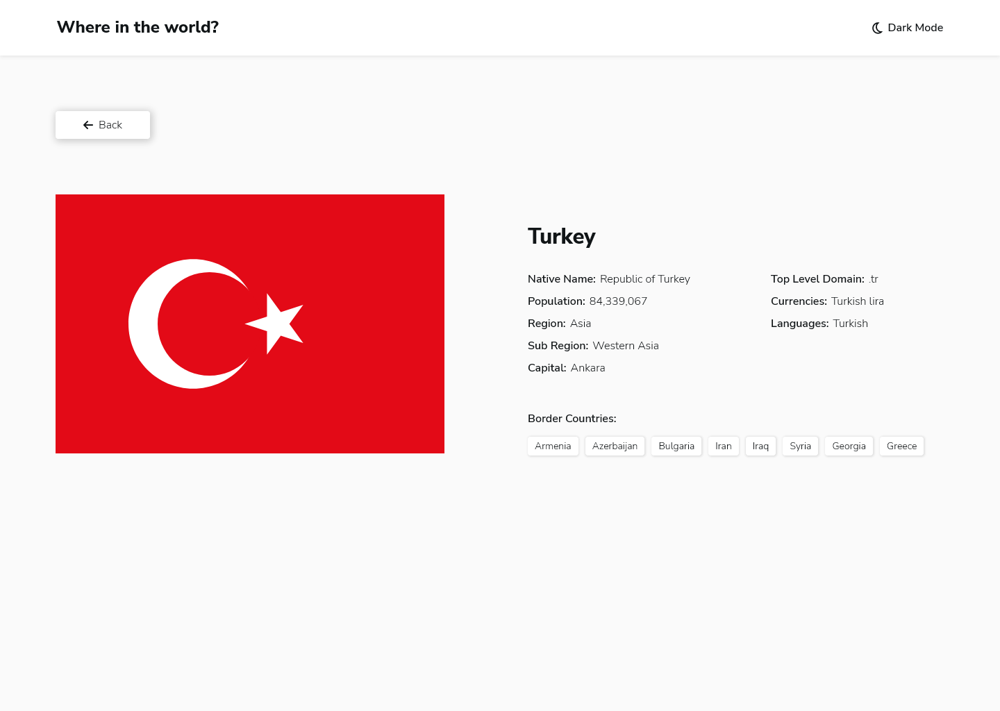
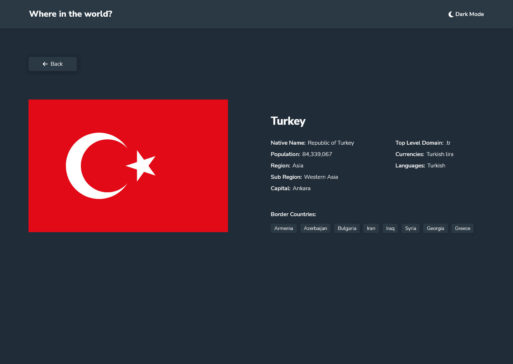

# Frontend Mentor - REST Countries API with color theme switcher solution

This is a solution to the [REST Countries API with color theme switcher challenge on Frontend Mentor](https://www.frontendmentor.io/challenges/rest-countries-api-with-color-theme-switcher-5cacc469fec04111f7b848ca). Frontend Mentor challenges help you improve your coding skills by building realistic projects. 

## Table of contents

- [Overview](#overview)
  - [The challenge](#the-challenge)
  - [Screenshot](#screenshot)
  - [Links](#links)
- [My process](#my-process)
  - [Built with](#built-with)
- [Author](#author)

## Overview

### The challenge

Users should be able to:

- [x] See all countries from the API on the homepage
- [x] Search for a country using an `input` field
- [x] Filter countries by region
- [x] Click on a country to see more detailed information on a separate page
- [x] Click through to the border countries on the detail page
- [x] Toggle the color scheme between light and dark mode *(optional)*

### Screenshot

#### Home Page

#### Page Detail

### Links

- Solution URL: [Repository Project](https://github.com/Samuel-Amaro/rest-countries-api)
- Live Site URL: [Result Live](https://samuel-amaro.github.io/rest-countries-api/)

## My process

### Built with

- Semantic HTML5 markup
- CSS custom properties
- Flexbox
- CSS Grid
- Mobile-first workflow
- Responsive Web Design(RWD)
- Typescript
- [React](https://reactjs.org/) - JS library
  - [Hooks React](https://reactjs.org/docs/hooks-intro.html) - Hooks(useState)
  - [Context API](https://reactjs.org/docs/context.html) - Context API
- [react-router-dom](https://reactrouter.com/en/main) - Library React
- [Font-Awesome](https://fontawesome.com/icons) - Icons
- FETCH API JS
- [REST Countries API](https://restcountries.com) - API Countries
- [Bem Metodolody CSS Architecture](https://getbem.com/introduction/) - BEM CSS Architecture
- WebAcessibility with arias attributers, and roles

## Author

- Website - [Portefólio Samuel Amaro](https://samuel-amaro.github.io/portfolio-web/)
- Frontend Mentor - [@Samuel-Amaro](https://www.frontendmentor.io/profile/Samuel-Amaro)

## Execution Project

### Getting Started with Create React App

This project was bootstrapped with [Create React App](https://github.com/facebook/create-react-app).

#### Available Scripts

In the project directory, you can run:

#### `npm start`

Runs the app in the development mode.\
Open [http://localhost:3000](http://localhost:3000) to view it in your browser.

The page will reload when you make changes.\
You may also see any lint errors in the console.

#### `npm test`

Launches the test runner in the interactive watch mode.\
See the section about [running tests](https://facebook.github.io/create-react-app/docs/running-tests) for more information.

#### `npm run build`

Builds the app for production to the `build` folder.\
It correctly bundles React in production mode and optimizes the build for the best performance.

The build is minified and the filenames include the hashes.\
Your app is ready to be deployed!

See the section about [deployment](https://facebook.github.io/create-react-app/docs/deployment) for more information.

